# Steam Discovery Platform


## Overview
**Steam Discovery Platform** is a full-stack web application designed to help users find their next favorite game. It combines a robust **.NET 8 Web API** backend with a custom **Python-based AI recommendation engine** to provide personalized game suggestions based on user preferences (genre, popularity, and Metacritic scores). 

This project was built to demonstrate system-to-system communication, modern architectural patterns, and comprehensive integration testing.

## Data Source
The game data used in this project was sourced from **Kaggle**: 
[Steam Games Dataset](https://www.kaggle.com/datasets/crainbramp/steam-dataset-2025-multi-modal-gaming-analytics). 
The dataset includes information thousands of applications, including genres, descriptions, and user ratings, which were used to train the recommendation engine.

## Key Features
* **AI-Driven Recommendations:** Seamless integration between the .NET API and a Python microservice to generate tailored game lists.
* **Secure Authentication:** Full JWT-based authentication system with secure password hashing and role-based access control (User/Admin).
* **Personal Game Library:** Users can manage their personal collections, add new games, and mark their favorites.
* **Testing:** High test coverage using `xUnit`, `Moq`, 'Asserts' and `FluentAssertions` with an In-Memory Database for reliable integration testing (`SeededDbFactory`).
* **Modern Frontend:** Responsive UI built with React, connecting directly to the .NET proxy.

## CI/CD Pipeline
The project uses **GitHub Actions** to ensure code quality and reliability:
* **Automated Testing:** On every push or pull request to the `main` branch, the pipeline automatically:
    * Sets up the .NET environment.
    * Restores dependencies.
    * Builds the solution.
    * Runs the full suite of xUnit integration and unit tests.
* **Status Badges:** Real-time feedback on the repository's main page showing the current build status.

## Project Structure
A high-level overview of the repository organization:
* .github/workflows: CI/CD pipelines (GitHub Actions) that automatically run tests on every push.
* analytics-engine/: Python microservice responsible for the recommendation logic using Machine Learning.
* steam-discovery-platform/: The main .NET solution folder.
  * .Server/: ASP.NET Core Web API (Controllers, Services, Models).
  * .Server.Tests/: Integration and unit tests using xUnit and Moq.
  * .client/: React frontend application (Vite).


## Screenshots

<details>
  <summary>View Project Gallery</summary>
  
  ### Main Dashboard
  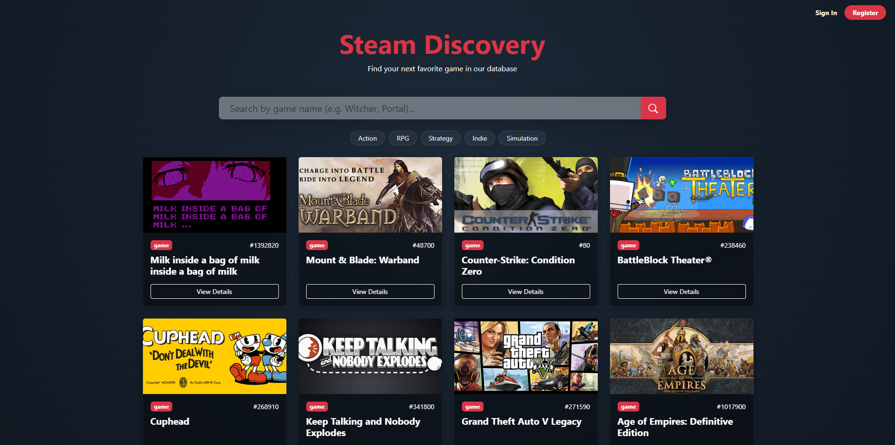

  ### Detailed Game Preview
  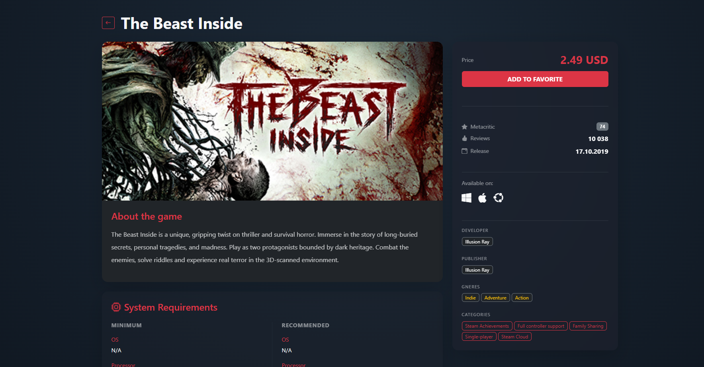

  ### AI Recommendations (by Title)
  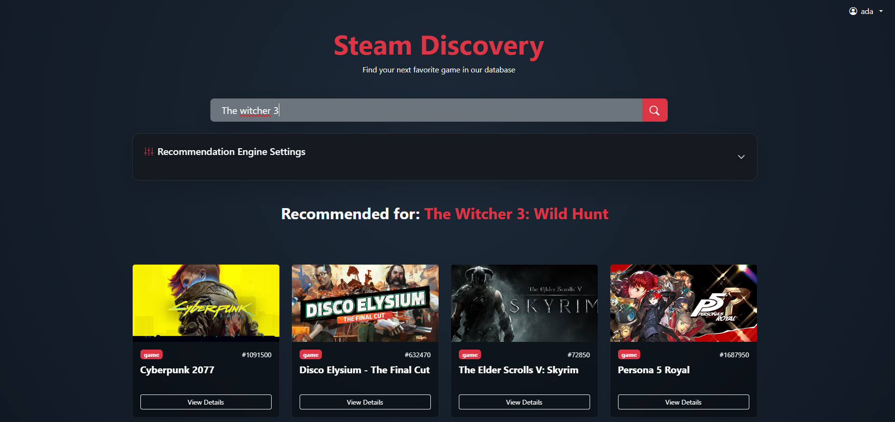

  ### ⚙Advanced Search with Filters
  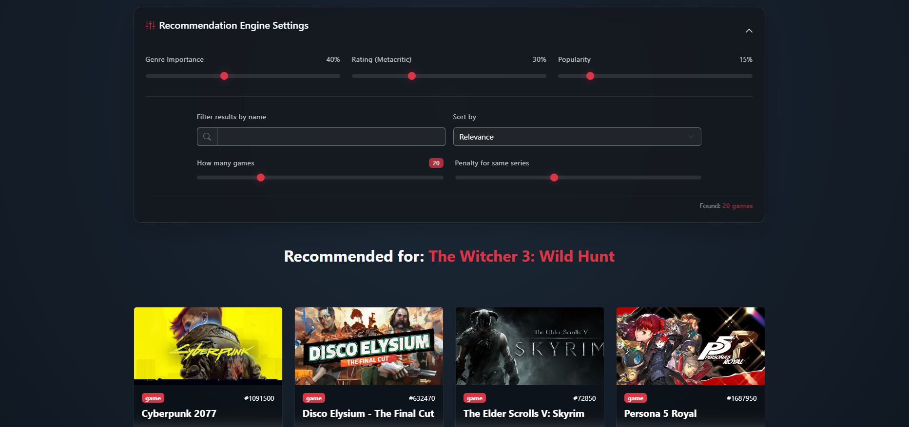
  
  ### User Authentication (Registration & Login)
  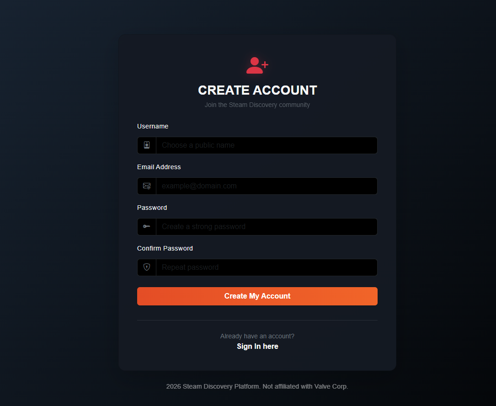
  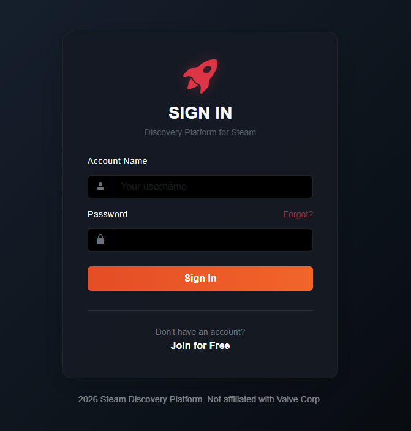

  ### User Profile Management
  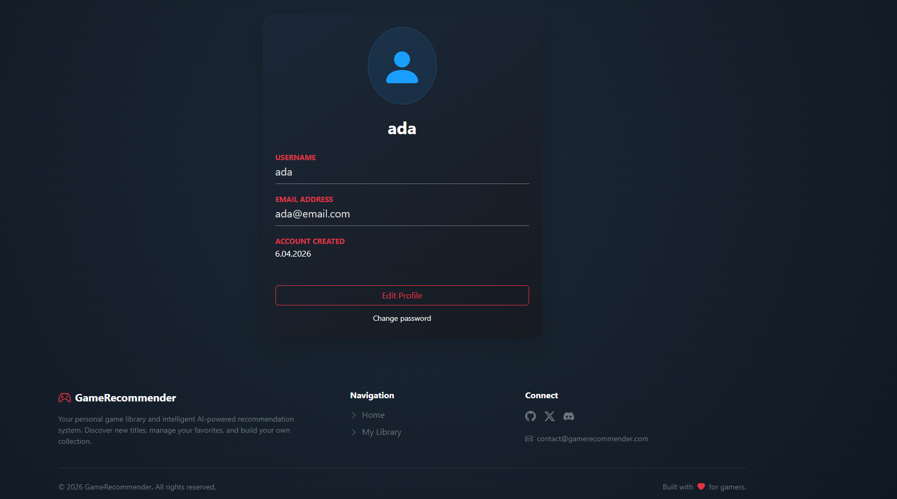

  ### Personal Game Collection
  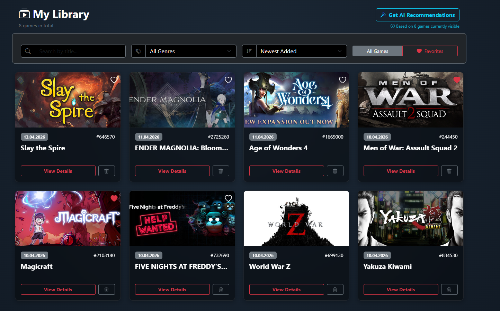

  ### Library Organization & Filtering
  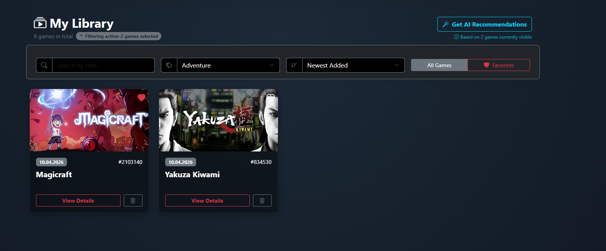

  ### Personalized Recommendations (Based on Library)
  *This feature analyzes the user's entire collection to suggest new titles.*
  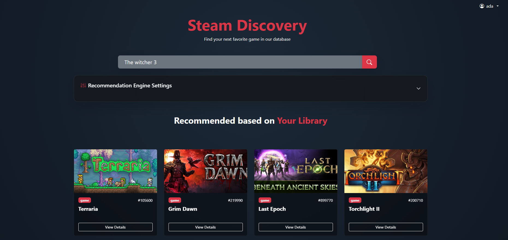

  ### Empty State UX
  *Example of how the system guides new users with no games in their library.*
  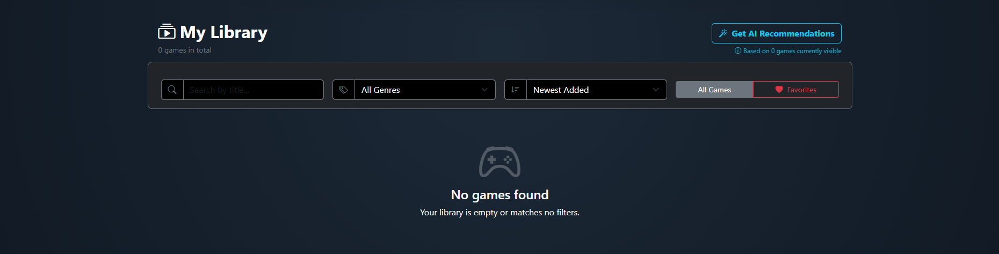

</details>

## Architecture & Tech Stack

## Database Schema (ERD)
The database is designed to handle complex relationships between users, games, and their metadata.

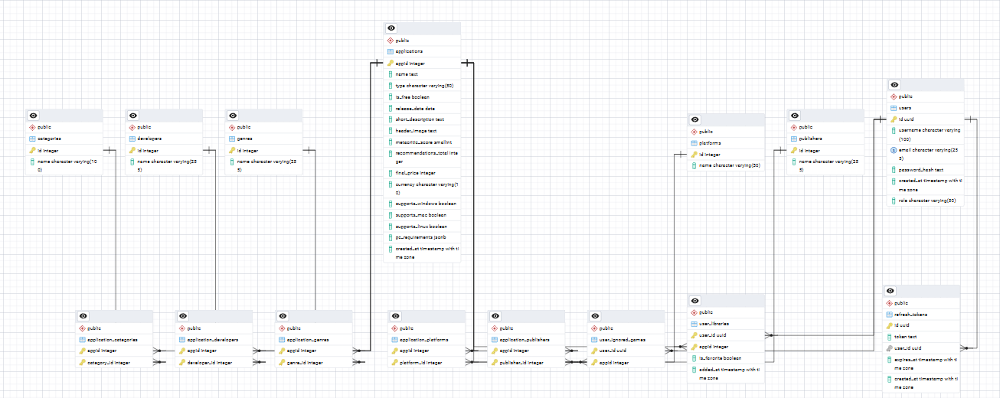

### Backend (.NET Web API)
* **Framework:** .NET 8
* **Database & ORM:** PostgreSQL, Entity Framework Core
* **Security:** JWT (JSON Web Tokens), ASP.NET Core Identity PasswordHasher
* **Testing:** xUnit, Moq, FluentAssertions, `WebApplicationFactory` for integration tests

### External Service (Python)
* **Framework:** [FastAPI, pickle, numpy, pandas,  sklearn.neighbors, sklearn.feature_extraction.text],
* **Logic:** Data processing and calculation of recommendation weights (Genre, Metacritic, Popularity),
* The recommendation engine utilizes the Nearest Neighbors algorithm to find game similarities in a multi-dimensional feature space.

### Frontend
* **Library:** React (Vite)
* **Styling:** [Tailwind CSS / CSS Modules / Boostrap]

## Getting Started

### Prerequisites
* .NET 8 SDK
* Node.js & npm
* Python 3.9+
* PostgreSQL server running locally

### Installation

1. **Clone the repository:**
   ```bash
   git clone [https://github.com/Codyy03/SteamRecommendationSystem.git](https://github.com/Codyy03/SteamRecommendationSystem.git)
   cd SteamRecommendationSystem

2. **Setup the Python Analytics Engine:**
    ```bash
   cd analytics-engine
   pip install -r requirements.txt
   uvicorn main:app --reload

3. **Setup the .NET Backend:**
    ```bash
   cd ../steam-discovery-platform/steam-discovery-platform.Server
   dotnet ef database update
   dotnet run
   
## Future Roadmap
* **Admin Dashboard:** A dedicated UI for managing game metadata and viewing platform analytics.
* **Dockerization:** Adding `docker-compose` support for easy one-command deployment of the API, Database, and Python service.